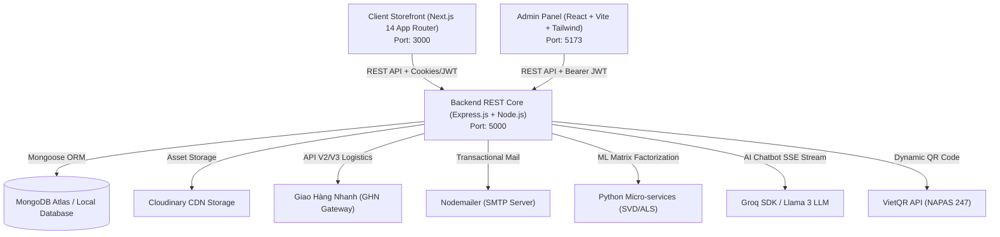
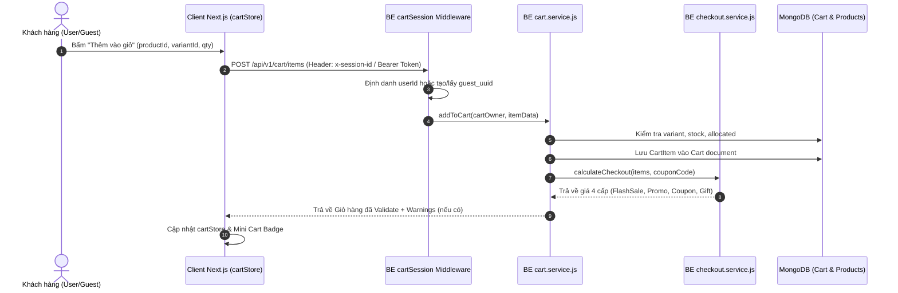
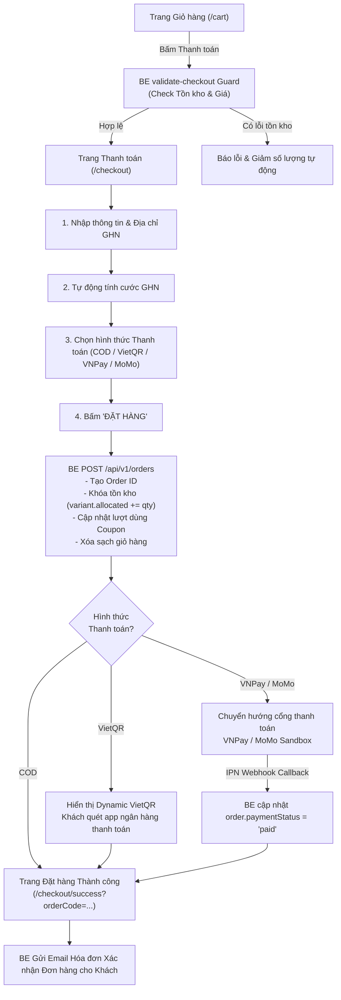
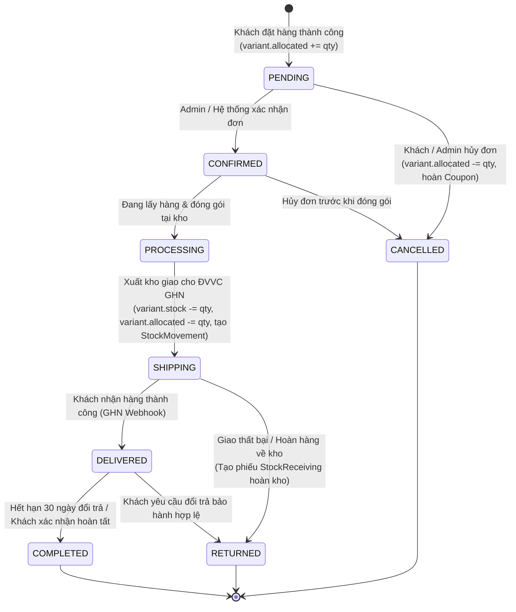

# Clone Haravan — Tài liệu Tính năng, Kiến trúc & Kế hoạch Phát triển Hệ thống TMĐT

> Tham khảo giao diện & trải nghiệm chuẩn: [EGA Điện Máy](https://ega-dien-may.myharavan.com) — Haravan Enterprise Theme.  
> Tài liệu cập nhật toàn diện phục vụ thiết kế, tích hợp và triển khai phân hệ **Cart, Checkout, Orders, Logistics & Payments**.

---

## 📑 Mục lục

1. [Tổng quan Kiến trúc Toàn hệ thống (Architecture Overview)](#1-tổng-quan-kiến-trúc-toàn-hệ-thống)
2. [Chi tiết Giao diện Khách hàng (Client Storefront)](#2-chi-tiết-giao-diện-khách-hàng-client-storefront)
3. [Phân hệ Trọng tâm: Giỏ hàng (Cart System)](#3-phân-hệ-trọng-tâm-giỏ-hàng-cart-system)
4. [Phân hệ Trọng tâm: Quy trình Thanh toán (Checkout Engine & Flow)](#4-phân-hệ-trọng-tâm-quy-trình-thanh-toán-checkout-engine--flow)
5. [Phân hệ Trọng tâm: Quản lý Đơn hàng (Order Management System - OMS)](#5-phân-hệ-trọng-tâm-quản-lý-đơn-hàng-order-management-system---oms)
6. [Tích hợp Vận chuyển & Hậu cần GHN (Logistics Integration)](#6-tích-hợp-vận-chuyển--hậu-cần-ghn-logistics-integration)
7. [Tích hợp Cổng Thanh toán (Payment Gateways: VietQR, COD, VNPay, MoMo)](#7-tích-hợp-cổng-thanh-toán-payment-gateways-vietqr-cod-vnpay-momo)
8. [Kiến trúc & Logic Nghiệp vụ Backend (BE Core Services)](#8-kiến-trúc--logic-nghiệp-vụ-backend-be-core-services)
9. [Chi tiết Giao diện & Luồng xử lý Admin Panel](#9-chi-tiết-giao-diện--luồng-xử-lý-admin-panel)
10. [Động cơ Tìm kiếm & Gợi ý AI (AI Search & Recommendations)](#10-động-cơ-tìm-kiếm--gợi-ý-ai-ai-search--recommendations)
11. [Phân tích Khoảng trống (Gap Analysis) cho 1 Website TMĐT Hoàn chỉnh](#11-phân-tích-khoảng-trống-gap-analysis-cho-1-website-tmđt-hoàn-chỉnh)
12. [Kế hoạch & Nhiệm vụ Tích hợp Trọng tâm (Integration Blueprint Tối Nay)](#12-kế-hoạch--nhiệm-vụ-tích-hợp-trọng-tâm-integration-blueprint-tối-nay)

---

## 1. Tổng quan Kiến trúc Toàn hệ thống

Hệ thống được chia thành 3 phân hệ chính hoạt động độc lập và đồng bộ dữ liệu thời gian thực:



---

## 2. Chi tiết Giao diện Khách hàng (Client Storefront)

### 2.1 Header & Navigation Bar
- **Logo** — Tên thương hiệu + Slogan, click về trang chủ.
- **Thanh tìm kiếm (Live SearchBar)**:
  - Input nhập từ khóa có debounce 300ms.
  - Dropdown Live Autocomplete gợi ý tức thì sản phẩm (kèm ảnh nhỏ, giá bán) và bài viết liên quan.
  - Tích hợp **Visual Search (Tìm kiếm bằng hình ảnh)**: Upload ảnh sản phẩm để tìm kiếm sản phẩm tương đồng về thị giác.
- **Badge LIVE** — Nhấp nháy dẫn tới trang livestream khuyến mãi.
- **Menu Tài khoản (AccountMenu)**:
  - Chưa đăng nhập: Nút Đăng nhập / Đăng ký.
  - Đã đăng nhập: Dropdown hiển thị Avatar, Tên, Số điện thoại, Menu dẫn nhanh tới Đơn hàng của tôi, Sổ địa chỉ, Đổi mật khẩu, Nút Đăng xuất.
- **Icon Giỏ hàng (Cart Button & Mini Cart)**:
  - Hiển thị badge số lượng sản phẩm trong giỏ thời gian thực.
  - Hover / Click mở **Mini Cart Drawer** hiển thị nhanh danh sách món, nút thanh toán nhanh.
- **Thanh Mega Menu (HeaderNav)**:
  - Danh mục sản phẩm (Category Drawer đa cấp).
  - ⚡ Flash Sales (đồng hồ đếm ngược).
  - Trả góp 0%, Đặt lịch sửa chữa, Tin khuyến mãi, Hệ thống cửa hàng, Hotline 1900 1000.

### 2.2 Trang chủ (Homepage)
- **Hero Slider Banner**: Carousel ảnh sự kiện/chiến dịch tự động cuộn.
- **Promo Ticker Bar**: Thanh mã ưu đãi nổi bật có nút `Sao chép` nhanh mã coupon.
- **Trust Badges**: Cam kết Giao hàng 24h, Đổi trả 30 ngày, 100% Chính hãng, Deal hot bùng nổ.
- **Khuyến mãi Online (Coupon Cards Grid)**: Danh sách voucher phân cấp (Giảm tiền, Giảm %, Freeship) kèm điều kiện đơn tối thiểu và hạn dùng.
- **Flash Sale Widget**: Đồng hồ đếm ngược (Countdown Timer flip card), thanh tiến trình số lượng đã bán / còn lại, giá sốc Flash Sale.
- **Grid Danh mục Sản phẩm**: Icon tròn đại diện cho các ngành hàng điện máy, điện lạnh, gia dụng, âm thanh.
- **Tabbed Products (Gợi ý cho bạn)**: Chuyển tab danh mục linh hoạt hiển thị lưới sản phẩm nổi bật.
- **Month Brand Carousel**: Banner thương hiệu đối tác nổi bật (Samsung, Xiaomi, Panasonic, Daikin, Aqua...).
- **Featured Product Showcase**: Khối sản phẩm tâm điểm (chọn variant, chọn số lượng, nút Mua ngay/Thêm giỏ).
- **Bảng tin Khuyến mãi**: Grid bài viết tin tức mới nhất, mẹo vặt công nghệ.

### 2.3 Trang Danh sách Sản phẩm (Collections Page `/collections/[slug]`)
- **Breadcrumb**: Điều hướng phân cấp (Trang chủ / Danh mục / Nhóm sản phẩm).
- **Bộ lọc Sidebar Đa tiêu chí (Multi-Facet Filter Bar)**:
  - Lọc theo Mức giá (Dưới 1tr, 1-2tr, 2-5tr, 5-10tr, Trên 10tr).
  - Lọc theo Thương hiệu (Checkbox đa chọn có ô tìm kiếm thương hiệu).
  - Lọc theo Loại sản phẩm / Danh mục con.
  - Lọc theo Màu sắc (Color Swatches hình tròn màu).
  - Lọc theo Tags / Trạng thái (Flash Sale, Có quà tặng, Còn hàng).
- **Thanh sắp xếp (Sorting Bar)**: Tên A-Z, Tên Z-A, Giá tăng dần, Giá giảm dần, Mới nhất, Bán chạy nhất.
- **Product Card**:
  - Ảnh đại diện chính + hover đổi ảnh phụ.
  - Nhãn giảm giá `%`, badge Flash Sale, nhãn Quà tặng 0đ kèm theo.
  - Tên sản phẩm, Thương hiệu, SKU.
  - Giá bán hiện tại, giá gốc gạch chân.
  - Nút thêm nhanh vào giỏ (Quick Add to Cart) & Nút Xem nhanh (Quick View Modal).
- **Phân trang chuẩn Pagination**: Hiển thị số trang, Prev/Next.

### 2.4 Trang Chi tiết Sản phẩm (Product Detail Page `/products/[slug]`)
- **Gallery hình ảnh chuyên sâu**:
  - Ảnh lớn trung tâm kèm chế độ Zoom chi tiết / Lightbox xem ảnh kích thước thật.
  - Thumbnail Carousel nằm ngang bên dưới, bấm đổi ảnh chính mượt mà.
  - Tự động nhảy ảnh theo Màu sắc biến thể được chọn.
- **Khu vực Giá & Ưu đãi**:
  - Giá bán Flash Sale (nếu đang diễn ra chiến dịch) + Countdown Timer riêng.
  - Giá khuyến mãi Promotion + Tiết kiệm được bao nhiêu tiền.
  - Danh sách quyền lợi quà tặng (Gift items 0đ) đi kèm.
  - Khối mã giảm giá có thể áp dụng cho sản phẩm này kèm nút Sao chép.
- **Bộ chọn Biến thể Sản phẩm (Variant Selector)**:
  - Nút chọn Thuộc tính (Màu sắc, Dung lượng, Kích thước...) dạng Pill button.
  - Tự động cập nhật Tồn kho khả dụng, SKU và Giá bán tương ứng theo từng biến thể.
- **Bộ chọn Số lượng & Kiểm soát Tồn kho**:
  - Nút `−`, Ô nhập số lượng, Nút `+`.
  - Giới hạn không cho chọn quá tồn kho khả dụng (`stock - allocated`).
  - Cảnh báo tồn kho gấp (`Chỉ còn X sản phẩm trong kho!`).
- **Cụm Nút Hành động Mua hàng (CTAs)**:
  - Nút **"THÊM VÀO GIỎ HÀNG"**: Thêm vào giỏ mà không rời trang, hiển thị toast thông báo thành công và cập nhật mini cart.
  - Nút **"MUA NGAY VỚI GIÁ NÀY"**: Thêm sản phẩm vào giỏ và chuyển hướng ngay sang màn hình `/checkout`.
  - Nút **"So sánh"**: Thêm vào thanh so sánh thông số kỹ thuật (`/so-sanh`).
- **Thanh Mua hàng Cố định (Sticky Purchase Bar)**: Thanh bar dính ở đáy màn hình khi cuộn chuột qua khối CTA, giúp người dùng đặt mua bất cứ lúc nào.
- **Khối Nội dung Đa Tab**:
  - Tab 1: **Thông số kỹ thuật (Specs)** dạng bảng Key-Value chi tiết.
  - Tab 2: **Mô tả sản phẩm** định dạng Rich HTML.
  - Tab 3: **Đánh giá & Hỏi đáp sản phẩm (Reviews & Q&A)** kèm form gửi bình luận và đánh giá sao.
- **Cross-sell & Gợi ý Thông minh**:
  - Sản phẩm tương tự cùng danh mục.
  - Phụ kiện thường mua cùng (Upsell).
  - Sản phẩm bạn đã xem gần đây (Recently Viewed carousel).

### 2.5 Trang So sánh Thông số Kỹ thuật (`/so-sanh`)
- So sánh song song từ 2 đến 4 sản phẩm.
- Bảng so sánh trực quan: Giá, Thương hiệu, Tồn kho, và toàn bộ thuộc tính Specs kỹ thuật.

### 2.6 Trang Khách hàng Cá nhân (`/tai-khoan`)
- **Tab Tổng quan**: Thông tin tài khoản, cấp bậc thành viên, số đơn đã mua.
- **Tab Đơn hàng của tôi (`/tai-khoan?tab=orders`)**:
  - Bộ lọc trạng thái: Tất cả, Chờ xác nhận, Đang xử lý, Đang giao hàng, Đã hoàn tất, Đã hủy.
  - Ô tìm kiếm theo mã đơn hoặc tên sản phẩm.
  - Danh sách đơn hàng chi tiết: Ngày đặt, Mã đơn, Tổng tiền, Trạng thái đơn, Nút xem chi tiết, Nút Hủy đơn (nếu hợp lệ).
- **Tab Sổ địa chỉ nhận hàng (`/tai-khoan?tab=addresses`)**:
  - Thêm / Sửa / Xóa địa chỉ giao hàng.
  - Chọn Tỉnh/Thành -> Quận/Huyện -> Phường/Xã tích hợp GHN API.
  - Đánh dấu địa chỉ mặc định khi đặt hàng.
- **Tab Đổi mật khẩu & Bảo mật phiên (`/tai-khoan?tab=security`)**:
  - Đổi mật khẩu tài khoản.
  - Quản lý các thiết bị và phiên đăng nhập đang hoạt động.

---

## 3. Phân hệ Trọng tâm: Giỏ hàng (Cart System)

### 3.1 Luồng Dữ liệu & Quản lý Session Giỏ hàng



### 3.2 Bảng API Giỏ hàng Backend (`/api/v1/cart`)

| Phương thức | Endpoint | Middleware | Mô tả chức năng |
|---|---|---|---|
| `GET` | `/api/v1/cart` | `cartSession` | Lấy chi tiết giỏ hàng hiện tại, tự động re-validate tồn kho và tính lại giá 4 cấp |
| `POST` | `/api/v1/cart/items` | `cartSession` | Thêm sản phẩm vào giỏ (nhận `productId`, `variantId` hoặc `sku`, `quantity`) |
| `PATCH` | `/api/v1/cart/items/:itemId` | `cartSession` | Cập nhật số lượng của 1 dòng sản phẩm trong giỏ |
| `DELETE` | `/api/v1/cart/items/:itemId` | `cartSession` | Xóa 1 sản phẩm khỏi giỏ |
| `DELETE` | `/api/v1/cart` | `cartSession` | Xóa toàn bộ sản phẩm trong giỏ (Clear Cart) |
| `POST` | `/api/v1/cart/apply-coupon` | `cartSession` | Áp dụng mã giảm giá Coupon vào giỏ hàng |
| `DELETE` | `/api/v1/cart/remove-coupon` | `cartSession` | Gỡ bỏ mã giảm giá Coupon khỏi giỏ |
| `POST` | `/api/v1/cart/merge` | `protect`, `cartSession` | Hợp nhất giỏ hàng của Guest (`x-session-id`) vào giỏ User khi đăng nhập |
| `POST` | `/api/v1/cart/validate-checkout`| `cartSession` | Kiểm tra toàn diện tồn kho & điều kiện trước khi chuyển sang màn hình Checkout |

### 3.3 Chi tiết Giao diện Trang Giỏ hàng (`/cart`)
- **Thanh Tiến trình Nhận quà (Progress Reward Bar)**:
  - Thanh đo phần trăm theo tổng giá trị đơn hàng.
  - Các mốc thưởng trực quan:
    - Mốc 1 (VD: 500.000₫): Miễn phí vận chuyển toàn quốc.
    - Mốc 2 (VD: 2.000.000₫): Tặng voucher giảm trực tiếp 100.000₫.
    - Mốc 3 (VD: 5.000.000₫): Tặng bộ quà tặng công nghệ 0đ.
- **Danh sách Sản phẩm trong Giỏ**:
  - Ảnh đại diện, Tên sản phẩm (link đến trang chi tiết), Nhãn biến thể (Màu, Dung lượng).
  - Đơn giá gốc (gạch chân) & Đơn giá thực tế (sau Flash Sale / Promo).
  - Bộ điều chỉnh số lượng `−` `Số` `+` (tự động disable `+` nếu chạm ngưỡng tồn kho thực tế).
  - Nút Xóa (Icon thùng rác).
  - Thành tiền của dòng.
- **Khối Quà tặng Kèm 0đ (Gift Items)**:
  - Tự động hiển thị các sản phẩm quà tặng 0đ được kích hoạt từ Gift Program.
  - Không cho phép tăng số lượng tùy tiện (số lượng quà gắn chặt với điều kiện chương trình).
- **Khối Tiện ích Bổ sung chuẩn Haravan / EGA**:
  - **Xuất hóa đơn VAT cho doanh nghiệp**: Checkbox toggle mở form nhập: Tên công ty, Mã số thuế (MST), Địa chỉ công ty, Email nhận HĐĐT.
  - **Hẹn giờ giao hàng**: Bộ chọn ngày nhận hàng & khung giờ mong muốn (Sáng 8h-12h, Chiều 14h-18h, Tối 18h-21h).
  - **Ghi chú đơn hàng**: Textarea nhập lời nhắn cho shipper hoặc cửa hàng.
- **Khối Tóm tắt & Mã Giảm giá (Order Summary Box)**:
  - Ô nhập mã Coupon + Nút Áp dụng.
  - Nút "Chọn mã ưu đãi": Mở Drawer/Modal danh sách Coupon khả dụng để chọn ngay.
  - Tạm tính tiền hàng: `XXX.XXX₫`.
  - Giảm giá Flash Sale: `- XXX.XXX₫`.
  - Giảm giá Khuyến mãi Promotion: `- XXX.XXX₫`.
  - Giảm giá Coupon: `- XXX.XXX₫`.
  - **TỔNG CỘNG THANH TOÁN**: `XXX.XXX₫` (nổi bật, số to rõ ràng).
  - Nút CTA chính: **"TIẾN HÀNH THANH TOÁN"** (Chuyển tiếp sang `/checkout`).

---

## 4. Phân hệ Trọng tâm: Quy trình Thanh toán (Checkout Engine & Flow)

### 4.1 Quy trình Đặt hàng Toàn cảnh (End-to-End Checkout Flow)



### 4.2 Cấu trúc Giao diện Trang Thanh toán (`/checkout`)

Thiết kế giao diện 3 cột hoặc 2 cột responsive chuẩn tỷ lệ chuyển đổi cao:

#### Cột 1: Thông tin Giao hàng (Shipping Details)
- Nếu đã đăng nhập: Tự động tải danh sách từ Sổ địa chỉ của User, cho phép chọn nhanh hoặc thêm địa chỉ mới.
- Nếu là khách vãng lai (Guest):
  - Họ và tên người nhận (*).
  - Số điện thoại liên hệ (*).
  - Email nhận hóa đơn & thông tin đơn hàng (*).
- **Bộ chọn Địa chỉ Chuẩn hóa GHN (3 cấp)**:
  - Dropdown Tỉnh / Thành phố (lấy từ API GHN).
  - Dropdown Quận / Huyện (lấy từ API GHN theo Tỉnh đã chọn).
  - Dropdown Phường / Xã (lấy từ API GHN theo Quận đã chọn).
  - Địa chỉ chi tiết (Số nhà, tên đường, tòa nhà).
  - Nhãn tự động chuẩn hóa địa chỉ sau sáp nhập GHN v3 (nếu có).

#### Cột 2: Vận chuyển & Phương thức Thanh toán
- **Phương thức Vận chuyển**:
  - Giao hàng Nhanh GHN (Standard Delivery): Tự động tính phí dựa trên trọng lượng gói hàng và khoảng cách từ kho Shop tới người nhận. Hiển thị ngày dự kiến nhận hàng.
  - Giao hỏa tốc 2h - 4h (Áp dụng cho nội thành TP.HCM / Hà Nội).
- **Phương thức Thanh toán**:
  - 💵 **Thanh toán khi nhận hàng (COD)**: Trả tiền mặt cho shipper khi nhận hàng.
  - 🏦 **Chuyển khoản Ngân hàng qua mã VietQR**: Sinh mã QR chuẩn NAPAS 24/7 tự động điền đúng số tiền và cú pháp mã đơn.
  - 💳 **Cổng thanh toán VNPay**: Hỗ trợ thẻ ATM nội địa, thẻ quốc tế Visa/Mastercard/JCB, VNPay-QR.
  - 📱 **Ví điện tử MoMo**: Thanh toán qua ứng dụng MoMo.

#### Cột 3: Tóm tắt Đơn hàng (Order Summary)
- Danh sách sản phẩm thu nhỏ: Ảnh, Tên, Biến thể, Số lượng, Đơn giá.
- Danh sách quà tặng 0đ đi kèm.
- Khung nhập / Thay đổi mã giảm giá Coupon.
- Chi tiết bảng giá:
  - Tạm tính tiền hàng: `XXX.XXX₫`
  - Giảm giá khuyến mãi: `- XXX.XXX₫`
  - Giảm giá Coupon: `- XXX.XXX₫`
  - Phí vận chuyển GHN: `+ XX.XXX₫`
  - **TỔNG TIỀN PHẢI THANH TOÁN**: `XXX.XXX₫`
- Nút bấm hành động: **"ĐẶT HÀNG NGAY"** (Có loading spinner chống click đúp, thông báo điều khoản mua hàng).

---

## 5. Phân hệ Trọng tâm: Quản lý Đơn hàng (Order Management System - OMS)

### 5.1 Cấu trúc Schema Đơn hàng Chi tiết (`order.model.js`)

```javascript
const orderSchema = new mongoose.Schema(
  {
    orderCode: {
      type: String,
      required: true,
      unique: true,
      trim: true,
      uppercase: true, // VD: HD-20261007-001 hoặc EGA-984210
    },
    userId: {
      type: mongoose.Schema.Types.ObjectId,
      ref: 'User',
      default: null, // null nếu là khách vãng lai
    },
    customerInfo: {
      fullName: { type: String, required: true },
      phone: { type: String, required: true },
      email: { type: String, required: true },
      note: { type: String, default: '' },
    },
    shippingAddress: {
      fullName: { type: String, required: true },
      phone: { type: String, required: true },
      province: { type: String, required: true },
      provinceId: { type: Number, default: null },
      district: { type: String, required: true },
      districtId: { type: Number, default: null },
      ward: { type: String, required: true },
      wardCode: { type: String, default: '' },
      detailAddress: { type: String, required: true },
      fullAddress: { type: String, required: true },
    },
    invoiceInfo: {
      required: { type: Boolean, default: false },
      companyName: { type: String, default: '' },
      taxCode: { type: String, default: '' },
      companyAddress: { type: String, default: '' },
      companyEmail: { type: String, default: '' },
    },
    items: [
      {
        productId: { type: mongoose.Schema.Types.ObjectId, ref: 'Product', required: true },
        variantId: { type: mongoose.Schema.Types.ObjectId, ref: 'ProductVariant', required: true },
        productName: { type: String, required: true },
        variantName: { type: String, default: '' },
        sku: { type: String, required: true },
        thumbnail: { type: String, default: '' },
        quantity: { type: Number, required: true, min: 1 },
        originalPrice: { type: Number, required: true },
        unitPrice: { type: Number, required: true }, // Giá sau FlashSale / Promo
        subtotal: { type: Number, required: true },
        isFlashSale: { type: Boolean, default: false },
        isGift: { type: Boolean, default: false },
        giftProgramId: { type: mongoose.Schema.Types.ObjectId, ref: 'GiftProgram', default: null },
      },
    ],
    pricing: {
      subtotalOriginal: { type: Number, required: true },
      subtotalAfterDiscount: { type: Number, required: true },
      flashSaleDiscount: { type: Number, default: 0 },
      promotionDiscount: { type: Number, default: 0 },
      couponDiscount: { type: Number, default: 0 },
      couponCode: { type: String, default: null },
      shippingFee: { type: Number, default: 0 },
      finalTotal: { type: Number, required: true },
    },
    paymentMethod: {
      type: String,
      enum: ['COD', 'VIETQR', 'VNPAY', 'MOMO', 'BANK_TRANSFER'],
      default: 'COD',
    },
    paymentStatus: {
      type: String,
      enum: ['UNPAID', 'PENDING', 'PAID', 'REFUNDED', 'FAILED'],
      default: 'UNPAID',
    },
    paymentDetails: {
      transactionId: { type: String, default: '' },
      paidAt: { type: Date, default: null },
      bankCode: { type: String, default: '' },
      gatewayResponse: { type: Object, default: null },
    },
    orderStatus: {
      type: String,
      enum: [
        'PENDING',    // Chờ xác nhận
        'CONFIRMED',  // Đã xác nhận đơn
        'PROCESSING', // Đang đóng gói
        'SHIPPING',   // Đã giao cho đơn vị vận chuyển GHN
        'DELIVERED',  // Giao hàng thành công
        'COMPLETED',  // Đơn hàng hoàn tất
        'CANCELLED',  // Đã hủy đơn
        'RETURNED',   // Đã trả hàng hoàn tiền
      ],
      default: 'PENDING',
    },
    shippingLogistics: {
      carrier: { type: String, default: 'GHN' },
      ghnOrderCode: { type: String, default: '' }, // Mã vận đơn GHN
      ghnExpectedDeliveryDate: { type: Date, default: null },
      ghnFee: { type: Number, default: 0 },
      trackingLogs: [
        {
          status: { type: String },
          description: { type: String },
          timestamp: { type: Date, default: Date.now },
          location: { type: String, default: '' },
        },
      ],
    },
    scheduledDelivery: {
      deliveryDate: { type: String, default: '' },
      deliveryTimeSlot: { type: String, default: '' },
    },
    statusHistory: [
      {
        status: { type: String, required: true },
        note: { type: String, default: '' },
        changedBy: { type: mongoose.Schema.Types.ObjectId, ref: 'User', default: null },
        changedAt: { type: Date, default: Date.now },
      },
    ],
    cancelledReason: { type: String, default: '' },
    cancelledAt: { type: Date, default: null },
  },
  { timestamps: true }
);
```

### 5.2 Vòng đời Trạng thái Đơn hàng & Xử lý Kho (Order Lifecycle State Machine)



### 5.3 Danh mục API Quản lý Đơn hàng (`/api/v1/orders`)

| Phương thức | Endpoint | Phân quyền | Mô tả chức năng |
|---|---|---|---|
| `POST` | `/api/v1/orders` | Public / Guest / User | Đặt đơn hàng mới từ giỏ hàng (Validate tồn kho, khóa allocated, sinh mã đơn, xóa giỏ) |
| `GET` | `/api/v1/orders/my-orders` | User (`protect`) | Lấy danh sách lịch sử đơn hàng của tài khoản đang đăng nhập |
| `GET` | `/api/v1/orders/tracking/:orderCode` | Public | Tra cứu hành trình đơn hàng bằng mã đơn + số điện thoại |
| `GET` | `/api/v1/orders/:id` | User / Admin | Xem chi tiết 1 đơn hàng cụ thể |
| `PATCH` | `/api/v1/orders/:id/cancel` | User / Admin | Khách hàng hoặc Admin hủy đơn (chỉ khi đơn ở trạng thái `PENDING` / `CONFIRMED`) |
| `GET` | `/api/v1/orders` | Admin (`order.view`) | Danh sách đơn hàng toàn hệ thống kèm bộ lọc đa tiêu chí, phân trang |
| `PATCH` | `/api/v1/orders/:id/status` | Admin (`order.manage`) | Cập nhật trạng thái đơn hàng (Xác nhận, Đang đóng gói, Hoàn tất...) |
| `POST` | `/api/v1/orders/:id/push-ghn` | Admin (`order.manage`) | Đẩy thông tin đơn sang GHN lấy mã vận đơn `ghnOrderCode` và tem in |
| `GET` | `/api/v1/orders/:id/print` | Admin (`order.view`) | Lấy dữ liệu in Phiếu xuất kho / Phiếu giao hàng / Hóa đơn bán lẻ |
| `PATCH` | `/api/v1/orders/:id/payment-status` | Admin (`order.manage`)| Cập nhật trạng thái thanh toán thủ công (Xác nhận đã nhận tiền mặt/CK) |

---

## 6. Tích hợp Vận chuyển & Hậu cần GHN (Logistics Integration)

### 6.1 Các Hàm Nghiệp vụ Bổ sung trong `ghn.service.js`

1. **`calculateShippingFee({ toDistrictId, toWardCode, weight, length, width, height, insuranceValue })`**:
   - Gọi API GHN endpoint `/v2/shipping-order/fee`.
   - Tính toán cước phí vận chuyển chính xác từ địa chỉ kho mặc định của Shop đến địa chỉ người mua.
   - Hỗ trợ tính bảo hiểm hàng hóa theo giá trị đơn hàng.
2. **`createShippingOrder(orderDoc)`**:
   - Gọi API GHN endpoint `/v2/shipping-order/create`.
   - Truyền danh sách mặt hàng, kích thước đóng gói, số tiền thu hộ COD (nếu paymentMethod === 'COD').
   - Nhận về: `order_code` (Mã vận đơn GHN, ví dụ `GHN12345678`), `expected_delivery_time`, `total_fee`.
3. **`generateGhnPrintToken(orderCodes)`**:
   - Gọi API GHN endpoint `/v2/a5/gen-token` để lấy link in mã vạch A5/A4 dán lên thùng hàng.
4. **`cancelShippingOrder(orderCode)`**:
   - Gọi API GHN endpoint `/v2/switch-status/cancel` để hủy vận đơn nếu đơn hàng bị hủy trước khi shipper đến lấy.
5. **`ghnWebhookHandler(payload)`**:
   - Nhận Webhook từ GHN khi đơn chuyển trạng thái (`picking`, `storing`, `delivering`, `delivered`, `return`).
   - Tự động cập nhật `order.shippingLogistics.trackingLogs` và `order.orderStatus` tương ứng trong MongoDB.

---

## 7. Tích hợp Cổng Thanh toán (Payment Gateways)

### 7.1 Thanh toán Chuyển khoản Tự động qua VietQR (NAPAS 24/7)
- **Cơ chế**: Sinh ảnh mã QR động theo chuẩn VietQR với cấu trúc URL:
  `https://img.vietqr.io/image/{BANK_ID}-{ACCOUNT_NO}-compact2.png?amount={TOTAL_AMOUNT}&addInfo={ORDER_CODE}&accountName={ACCOUNT_NAME}`
- **Ưu điểm**: Khách hàng mở bất kỳ ứng dụng ngân hàng nào (Vietcombank, MBBank, Techcombank, VPBank...) quét mã là tự động điền đúng Số tài khoản, Tên thụ hưởng, Số tiền chuẩn từng đồng và Cú pháp nội dung chuyển khoản là Mã đơn hàng.
- **Xác nhận**: Tích hợp hiển thị trực tiếp trên trang `/checkout/success` và gửi kèm trong email xác nhận.

### 7.2 Thanh toán Trực tuyến qua Cổng VNPay / MoMo
- **VNPay Sandbox**:
  - Tạo URL thanh toán `vnp_CreatePaymentUrl` có chữ ký bảo mật HMAC-SHA512.
  - Return URL: Điều hướng khách về trang kết quả đơn hàng trên Client.
  - IPN URL (Server-to-Server Webhook): Kiểm tra checksum chữ ký số bí mật (`vnp_HashSecret`), cập nhật `paymentStatus = 'PAID'` tự động và chống gian lận dữ liệu.
- **MoMo Sandbox**:
  - Tạo Payment Request API v2 với chữ ký HMAC-SHA256 (`partnerCode`, `accessKey`, `secretKey`).
  - Xử lý IPN Webhook callback tự động.

---

## 8. Kiến trúc & Logic Nghiệp vụ Backend (BE Core Services)

### 8.1 Động cơ Giảm giá 4 Cấp Chống Xung đột Giá (`checkout.service.js`)
Đường ống tính giá 4 bước chuẩn doanh nghiệp:
1. **Cấp 1 — Flash Sale**: Thay thế giá bán trực tiếp bằng giá Flash Sale, đánh dấu cờ `isFlashSale`.
2. **Cấp 2 — Promotion Sản phẩm**: Chỉ áp dụng cho các sản phẩm không thuộc Flash Sale, tự động chọn khuyến mãi giảm sâu nhất theo danh mục hoặc theo từng sản phẩm.
3. **Cấp 3 — Mã Giảm giá Coupon**: Áp dụng trên tổng giá trị đơn hàng sau khi đã trừ Flash Sale & Promotion (tránh giảm giá 2 lần trên hàng Flash Sale).
4. **Cấp 4 — Chương trình Quà tặng 0đ (Gift Program)**: Tự động kiểm tra điều kiện đơn hàng để tặng kèm các sản phẩm giá 0đ.

### 8.2 Chuỗi Cung ứng & Quản lý Kho Chuyên sâu (WMS)
- **Đơn Nhập kho PO (`purchaseOrder.service.js`)**: Sinh mã `PO-YYYYMMDD-XXX`, xuất mẫu Excel chuẩn `mau-don-dat-hang.xlsx` (có công thức thuế VAT 10%, phí ship, chữ ký), gửi email trực tiếp cho Nhà cung cấp và lưu trữ đám mây Cloudinary.
- **Phiếu Nhập kho (`stockReceiving.service.js`)**: Tăng tồn kho thực tế, ghi nhật ký biến động kho `StockMovement`.
- **Phiếu Xuất kho (`stockExport.service.js`)**: Xuất bán lẻ, xuất trả NCC, xuất hủy hỏng.
- **Kiểm kê Kho (`stockAudit.service.js`)**: Đối soát số lượng hệ thống và thực tế kiểm đếm, tự động cân bằng kho.
- **Cảnh báo Tồn kho (`stockAlert.service.js`)**: Cảnh báo tức thì sản phẩm dưới ngưỡng an toàn (`stock <= threshold`) hoặc đã hết hàng (`stock = 0`).

---

## 9. Chi tiết Giao diện & Luồng xử lý Admin Panel

### 9.1 Phân hệ Quản trị Hiện có

| Module | Route | Tính năng chính |
|---|---|---|
| **Dashboard** | `/dashboard` | Tổng quan chỉ số, báo cáo tồn kho thấp, phân bổ ngành hàng, Quick Search toàn cục |
| **Media Library** | `/media` | Quản lý cây thư mục ảnh Cloudinary, kiểm tra an toàn liên kết trước khi xóa (`check-usages`) |
| **Banners** | `/banners` | Quản lý Carousel banner trang chủ, vị trí hiển thị, lịch ẩn/hiện |
| **Danh mục & Thương hiệu** | `/categories`, `/brands` | Quản lý cây danh mục đa cấp, thương hiệu chính hãng, SEO Meta |
| **Sản phẩm & Biến thể** | `/products`, `/products/new`, `/:id/variants` | Quản lý sản phẩm, thông số specs, biến thể SKU/Màu/Dung lượng |
| **Import / Export Excel** | `/products/import` | Tải mẫu template `.xlsx` có dropdown validation, import sản phẩm tự động tải ảnh về Cloudinary |
| **Marketing 4 Cấp** | `/promotions/*` | Quản lý Coupons, Khuyến mãi giảm giá, Chương trình quà tặng 0đ, Chiến dịch Flash Sale |
| **Quản lý Kho WMS** | `/purchase-orders`, `/stock-*`, `/suppliers` | Đơn nhập PO, Phiếu nhập, Phiếu xuất, Kiểm kê, Trả hàng, Cảnh báo kho, Báo cáo tồn kho |
| **CMS Blog & Menus** | `/blog/*`, `/menus` | Đăng bài viết tin tức, Bộ đo điểm SEO tự động (`blogSeo`), Bộ dựng Tree Menu đa cấp |
| **Tài khoản & Phân quyền** | `/customers`, `/staffs`, `/roles`, `/audit-logs` | Phân quyền RBAC ma trận chi tiết, Quản lý khách hàng, Nhật ký thao tác hệ thống |

### 9.2 Phân hệ Cần bổ sung trên Admin Panel: Quản lý Đơn hàng (OMS)

- **Trang Danh sách Đơn hàng (`/orders`)**:
  - Thanh tab trạng thái: Tất cả, Chờ duyệt, Đang đóng gói, Đang giao, Đã giao, Đã hoàn tất, Đã hủy, Hoàn trả.
  - Bảng dữ liệu hiển thị: Mã đơn, Thời gian đặt, Tên khách hàng & SĐT, Địa chỉ nhận, Tổng tiền, Hình thức thanh toán, Trạng thái thanh toán (Badge màu), Trạng thái đơn hàng.
  - Bộ lọc theo khoảng ngày, theo phương thức thanh toán, theo ĐVVC.
- **Trang Chi tiết Đơn hàng (`/orders/:id`)**:
  - Xem thông tin người nhận, địa chỉ GHN chuẩn hóa, ghi chú giao hàng, thông tin xuất hóa đơn VAT công ty.
  - Danh sách sản phẩm mua, biến thể, số lượng, đơn giá, chiết khấu, quà tặng 0đ kèm theo.
  - Khối Cập nhật Trạng thái đơn & Timeline lịch sử xử lý đơn.
  - Nút **"Đẩy đơn sang GHN"** (Tạo vận đơn và lấy mã vận đơn `ghnOrderCode`).
  - Nút **"In Phiếu Giao Hàng / Đóng Gói"** (Mở popup in khổ A4/A5 chuyên nghiệp).
  - Nút **"Xác nhận Thanh toán"** (Đối soát thu tiền mặt COD hoặc tiền chuyển khoản ngân hàng).
  - Nút **"Hủy Đơn Hàng"** (Nhập lý do hủy, tự động hoàn trả tồn kho `allocated`).

---

## 10. Động cơ Tìm kiếm & Gợi ý AI (AI Search & Recommendations)

- **Full-text Token Search & Autocomplete**: Phân tích từ khóa tìm kiếm tiếng Việt, trả về kết quả sản phẩm và bài viết ngay khi gõ.
- **Search Log Tracking (`searchLog.model.js`)**: Lưu vết từ khóa tìm kiếm để thống kê Xu hướng tìm kiếm (Trending Search Keywords).
- **Mô hình Gợi ý Cá nhân hóa AI Machine Learning (`python-services/matrix_factorization.py`)**:
  - Phân tích tương tác người dùng 4 cấp (`view`=1, `search_click`=2, `add_to_cart`=5, `purchase`=10).
  - Sử dụng thuật toán SVD/ALS phân rã ma trận nhân tố ẩn để dự đoán sở thích của từng User/Session và trả về Top N sản phẩm gợi ý cá nhân hóa vào MongoDB collection `personalizedrecommendations`.
- **AI Chatbot Trợ lý Mua sắm (`chat.service.js`)**: Sử dụng Groq SDK / Llama 3 trả về phản hồi streaming SSE, tự động tra cứu tồn kho, gợi ý sản phẩm phù hợp ngân sách của khách.
- **Visual Search (`visualSearch.service.js`)**: Tìm kiếm sản phẩm bằng hình ảnh thông qua trích xuất vector đặc trưng thị giác.

---

## 11. Phân tích Khoảng trống (Gap Analysis) cho 1 Website TMĐT Hoàn chỉnh

Dưới đây là ma trận đánh giá chi tiết giữa một sàn TMĐT hoàn chỉnh chuẩn Enterprise và trạng thái hiện tại của dự án:

| Hạng mục / Phân hệ | Yêu cầu Tiêu chuẩn TMĐT | Trạng thái Dự án Hiện tại | Đánh giá & Hướng Xử lý |
|---|---|---|---|
| **Catalog & Products (PIM)** | Multi-variant SKU, Specs, SEO, Images, Batch Excel, Flash sale, Promo | ✅ Hoàn thành 100% trên BE & Admin, 95% trên Client | Đã hoàn thiện xuất sắc. |
| **Kho & Chuỗi Cung ứng (WMS)** | Nhà cung cấp, PO Excel, Phiếu nhập/xuất/kiểm kê, Cảnh báo kho | ✅ Hoàn thành 100% trên BE & Admin | Đầy đủ tính năng doanh nghiệp. |
| **Giỏ hàng (Cart Module)** | Cart API, Real-time Stock validation, Guest/User session, Quà tặng 0đ | 🟡 BE xong 100%, Client chưa dựng UI & Store | **Cần làm Client:** Tạo `cartStore.js`, dựng trang `/cart`, Mini Cart Drawer, đấu nối nút "Thêm vào giỏ" trên Product Detail & Cards. |
| **Thanh toán (Checkout Flow)** | Form địa chỉ GHN, Tính cước ship, Chọn COD/VietQR/VNPay/MoMo, Đặt hàng | 🔴 BE mới có tính giá giảm 4 cấp; Client chưa có trang `/checkout` | **Trọng tâm tối nay:** Xây dựng endpoint `POST /api/v1/orders` trên BE và dựng trang `/checkout` trên Client. |
| **Quản lý Đơn hàng (OMS)** | Schema Order, Vòng đời trạng thái, Khóa tồn kho `allocated`, Hủy đơn, Tra cứu | 🔴 Chưa có Schema Order và Router Order trên BE; Admin chưa có trang `/orders` | **Trọng tâm tối nay:** Tạo `order.model.js`, `order.service.js`, `order.controller.js` trên BE và trang `/orders` trên Admin. |
| **Vận chuyển GHN (Logistics)** | Master data 63 tỉnh/thành, Tính phí ship tự động, Tạo vận đơn GHN, Webhook tracking | 🟡 Đã có Master data & tra cứu sáp nhập; Chưa có API tính cước & tạo vận đơn | **Cần bổ sung:** Thêm hàm `calculateShippingFee` và `createShippingOrder` vào `ghn.service.js`. |
| **Cổng Thanh toán (Payments)** | COD, Chuyển khoản VietQR động, Cổng thanh toán trực tuyến VNPay / MoMo | 🔴 Chưa tích hợp cổng thanh toán | **Cần bổ sung:** Tích hợp VietQR động trên trang cảm ơn + Service thanh toán VNPay/MoMo Sandbox. |
| **Email Giao dịch (Transactional Email)** | Email xác nhận đặt hàng, Email cập nhật vận chuyển, Email hủy đơn | 🟡 Đã có Nodemailer SMTP cho PO; Chưa có template email đơn hàng | **Cần bổ sung:** Thêm template HTML email xác nhận đơn hàng vào `email.service.js`. |
| **Đánh giá & Nhận xét (Reviews)** | Đánh giá 1-5 sao, xác thực đã mua hàng (Verified Buyer), duyệt đánh giá | 🟡 Đã có comment/Q&A; Chưa có luồng đánh giá sau mua hàng | Có thể triển khai tiếp theo sau phân hệ Order. |
| **Báo cáo Doanh thu (Analytics)** | Biểu đồ doanh thu ngày/tháng, AOV, Top sản phẩm bán chạy | 🟡 Dashboard đã có thống kê cơ bản; Chưa có biểu đồ doanh thu từ Order | Cập nhật truy vấn Aggregation từ `Order` vào `dashboard.service.js`. |

---

## 12. Kế hoạch & Nhiệm vụ Tích hợp Trọng tâm (Integration Blueprint Tối Nay)

Để tối nay 2 người phối hợp làm việc mượt mà và hiệu quả nhất, phân chia công việc theo 3 nhánh rõ ràng:

### 🔹 Nhánh 1: Backend Core (Phát triển API Đơn hàng & Vận chuyển)
1. **Tạo `order.model.js`**: Định nghĩa đầy đủ schema đơn hàng theo mục 5.1 (mã đơn, thông tin khách, địa chỉ GHN, snapshot items, pricing, payment, shippingLogistics, orderStatus).
2. **Tạo `order.service.js` & `order.controller.js`**:
   - `createOrder`: Validate tồn kho, gọi `checkout.service.js`, tăng `variant.allocated`, trừ lượt coupon, lưu đơn hàng, xóa giỏ hàng, gửi email xác nhận.
   - `getMyOrders`: Lấy lịch sử đơn hàng của User.
   - `getOrderDetail` & `trackOrderByCode`: Tra cứu đơn hàng.
   - `cancelOrder`: Hủy đơn, hoàn trả `variant.allocated` và hoàn coupon.
   - `updateOrderStatus` & `pushToGhn`: Dành cho Admin.
3. **Mở rộng `ghn.service.js`**:
   - Thêm `calculateShippingFee`: Tính cước giao hàng GHN.
   - Thêm `createShippingOrder`: Đẩy đơn sang GHN lấy mã tracking.
4. **Tạo `order.routes.js`** và mount vào `BE/src/routes/index.js`.

### 🔹 Nhánh 2: Client Storefront (Giao diện Giỏ hàng & Thanh toán)
1. **Tạo `client/src/store/cartStore.js` (Zustand)**:
   - Quản lý state giỏ hàng, đồng bộ với BE qua `/api/v1/cart`, lưu `cart_session` cho Guest, cập nhật badge giỏ hàng trên HeaderTop.
2. **Xây dựng Trang Giỏ hàng `client/src/app/cart/page.jsx`**:
   - Tiến trình nhận quà (Progress bar), Bảng danh sách sản phẩm (+/- số lượng, xóa), Quà tặng 0đ, Toggle VAT invoice, Ghi chú đơn, Chọn mã giảm giá Coupon, Nút Thanh toán.
3. **Xây dựng Trang Thanh toán `client/src/app/checkout/page.jsx`**:
   - Form thông tin nhận hàng, Bộ chọn địa chỉ GHN 3 cấp, Tự động gọi API tính cước ship, Chọn hình thức thanh toán (COD / VietQR / VNPay), Tóm tắt tiền và Nút "ĐẶT HÀNG".
4. **Xây dựng Trang Đặt hàng Thành công `client/src/app/checkout/success/page.jsx`**:
   - Hiển thị thông báo thành công, Mã đơn hàng, Khung mã QR VietQR động chuyển khoản (nếu chọn VietQR), Chi tiết địa chỉ và thời gian nhận dự kiến.
5. **Đấu nối Nút "Thêm vào giỏ" & "Mua ngay"**:
   - Đấu nối `ProductInfo.jsx`, `StickyPurchaseBar.jsx`, `ProductCard.jsx`, `QuickViewModal.jsx` gọi `cartStore.addToCart`.
6. **Đấu nối Tab Đơn hàng của tôi `client/src/components/account/AccountOrdersTab.jsx`**:
   - Gọi API lấy danh sách đơn hàng thật từ BE để hiển thị thay vì placeholder.

### 🔹 Nhánh 3: Admin Panel (Giao diện Quản lý Đơn hàng OMS)
1. **Tạo Trang Danh sách Đơn hàng `Admin/src/pages/orders/OrderListPage.jsx`**:
   - Tabs trạng thái đơn, Bảng danh sách đơn, Bộ lọc ngày/thanh toán, Nút xem chi tiết.
2. **Tạo Trang Chi tiết Đơn hàng `Admin/src/pages/orders/OrderDetailPage.jsx`**:
   - Xem chi tiết đơn hàng, Khối cập nhật trạng thái, Nút Đẩy sang GHN, Nút In phiếu đóng gói / Phiếu xuất kho.
3. **Khai báo Route `/orders` và `/orders/:id`** trong `Admin/src/router/index.jsx` kèm phân quyền `PermissionGuard`.

---

*Tài liệu được cập nhật toàn diện phục vụ phát triển & tích hợp hệ thống TMĐT: 2026-10-07*

